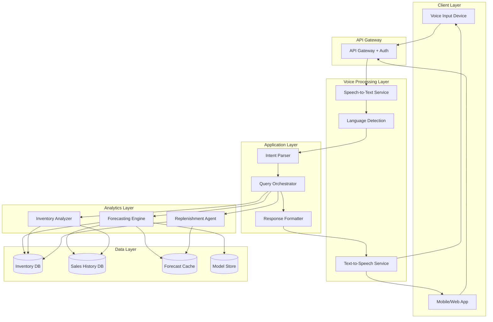
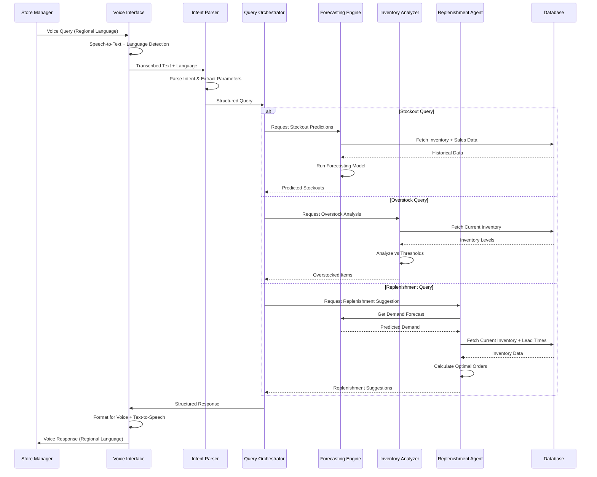

# Design Document: AI Retail Voice Operations Copilot

## Overview

The AI Retail Voice Operations Copilot is a cloud-based system that combines speech recognition, natural language understanding, time-series forecasting, and inventory analytics to provide store managers with voice-activated inventory intelligence. The system architecture follows a microservices pattern with clear separation between voice processing, business logic, and data analytics components.

The system processes voice queries through a pipeline: speech-to-text transcription → intent recognition → query execution → response generation → text-to-speech synthesis. Each component is designed for scalability, multilingual support, and real-time performance.

## Architecture

### High-Level Architecture



### Component Interaction Flow



## Components and Interfaces

### 1. Voice Interface Component

**Responsibilities:**
- Speech-to-text transcription
- Language detection and identification
- Text-to-speech synthesis
- Audio quality validation

**Interfaces:**

```typescript
interface VoiceInterface {
  // Transcribe audio to text
  transcribe(audio: AudioBuffer, language?: string): Promise<TranscriptionResult>
  
  // Detect language from audio
  detectLanguage(audio: AudioBuffer): Promise<LanguageCode>
  
  // Synthesize speech from text
  synthesize(text: string, language: LanguageCode, voice?: VoiceProfile): Promise<AudioBuffer>
  
  // Validate audio quality
  validateAudio(audio: AudioBuffer): AudioQualityMetrics
}

interface TranscriptionResult {
  text: string
  confidence: number
  language: LanguageCode
  alternates?: string[]
}

interface AudioQualityMetrics {
  signalToNoiseRatio: number
  clarity: number
  isAcceptable: boolean
}

type LanguageCode = 'en' | 'hi' | 'ta' | 'bn' | string
```

**Implementation Notes:**
- Use cloud-based speech services (AWS Transcribe, Google Speech-to-Text, or Azure Speech)
- Implement language detection using acoustic models
- Cache common responses to reduce synthesis latency
- Support streaming audio for real-time processing

### 2. Intent Parser Component

**Responsibilities:**
- Parse natural language queries into structured intents
- Extract query parameters (time ranges, SKU filters, thresholds)
- Handle multilingual input
- Validate query completeness

**Interfaces:**

```typescript
interface IntentParser {
  // Parse query text into structured intent
  parse(text: string, language: LanguageCode): Promise<ParsedIntent>
  
  // Validate if query is complete
  validateIntent(intent: ParsedIntent): ValidationResult
}

interface ParsedIntent {
  intentType: IntentType
  parameters: QueryParameters
  confidence: number
  language: LanguageCode
}

type IntentType = 
  | 'STOCKOUT_PREDICTION'
  | 'OVERSTOCK_DETECTION'
  | 'REPLENISHMENT_SUGGESTION'
  | 'ANOMALY_QUERY'
  | 'GENERAL_INVENTORY_QUERY'

interface QueryParameters {
  timeWindow?: TimeWindow
  skuFilters?: string[]
  storeIds?: string[]
  categoryFilters?: string[]
  thresholds?: ThresholdOverrides
}

interface TimeWindow {
  startDate?: Date
  endDate?: Date
  daysAhead?: number
}

interface ValidationResult {
  isValid: boolean
  missingParameters?: string[]
  suggestions?: string[]
}
```

**Implementation Notes:**
- Use NLU service (AWS Lex, Dialogflow, or Rasa) for intent classification
- Train models with retail-specific vocabulary and phrases
- Support slot filling for missing parameters
- Implement fallback to clarification questions

### 3. Forecasting Engine Component

**Responsibilities:**
- Predict future inventory levels and stockout dates
- Analyze historical sales patterns and trends
- Update forecasts with latest data
- Maintain forecast accuracy metrics

**Interfaces:**

```typescript
interface ForecastingEngine {
  // Predict stockouts within time window
  predictStockouts(params: StockoutPredictionParams): Promise<StockoutPrediction[]>
  
  // Get demand forecast for SKUs
  forecastDemand(skus: string[], timeWindow: TimeWindow): Promise<DemandForecast[]>
  
  // Update forecasts with latest data
  updateForecasts(storeId: string): Promise<UpdateResult>
  
  // Get forecast accuracy metrics
  getAccuracyMetrics(storeId: string, period: TimeWindow): Promise<AccuracyMetrics>
}

interface StockoutPredictionParams {
  storeId: string
  timeWindow: TimeWindow
  skuFilters?: string[]
  categoryFilters?: string[]
}

interface StockoutPrediction {
  sku: string
  skuName: string
  currentStock: number
  predictedStockoutDate: Date
  confidence: number
  urgencyLevel: 'HIGH' | 'MEDIUM' | 'LOW'
}

interface DemandForecast {
  sku: string
  forecastedDemand: number[]  // Daily demand for each day in window
  confidenceInterval: {
    lower: number[]
    upper: number[]
  }
  seasonalityFactor: number
}

interface AccuracyMetrics {
  mape: number  // Mean Absolute Percentage Error
  rmse: number  // Root Mean Square Error
  accuracy: number  // Percentage of correct predictions
  lastUpdated: Date
}
```

**Implementation Notes:**
- Use time-series forecasting models (ARIMA, Prophet, or LSTM)
- Incorporate external factors (promotions, holidays, weather)
- Implement ensemble methods for improved accuracy
- Store forecasts in cache with TTL for performance
- Retrain models monthly with recent data

### 4. Inventory Analyzer Component

**Responsibilities:**
- Detect overstocked items
- Identify inventory anomalies
- Calculate inventory metrics (days of supply, turnover rate)
- Compare against threshold levels

**Interfaces:**

```typescript
interface InventoryAnalyzer {
  // Detect overstocked items
  detectOverstock(params: OverstockDetectionParams): Promise<OverstockItem[]>
  
  // Detect inventory anomalies
  detectAnomalies(storeId: string, lookbackDays: number): Promise<InventoryAnomaly[]>
  
  // Calculate inventory metrics
  calculateMetrics(sku: string, storeId: string): Promise<InventoryMetrics>
}

interface OverstockDetectionParams {
  storeId: string
  thresholdMultiplier?: number  // Default 1.5 (150%)
  categoryFilters?: string[]
}

interface OverstockItem {
  sku: string
  skuName: string
  currentStock: number
  maxThreshold: number
  excessQuantity: number
  excessPercentage: number
  daysOfSupply: number
  estimatedValue: number
}

interface InventoryAnomaly {
  sku: string
  skuName: string
  anomalyType: 'SUDDEN_SPIKE' | 'SUDDEN_DROP' | 'GRADUAL_DRIFT' | 'MISSING_DATA'
  detectedDate: Date
  severity: 'HIGH' | 'MEDIUM' | 'LOW'
  description: string
  expectedValue: number
  actualValue: number
  deviationStdDevs: number
}

interface InventoryMetrics {
  sku: string
  currentStock: number
  averageDailySales: number
  daysOfSupply: number
  turnoverRate: number
  minThreshold: number
  maxThreshold: number
  reorderPoint: number
}
```

**Implementation Notes:**
- Use statistical methods for anomaly detection (Z-score, IQR)
- Implement sliding window analysis for trend detection
- Calculate thresholds based on historical variability
- Consider seasonality in anomaly detection

### 5. Replenishment Agent Component

**Responsibilities:**
- Generate optimal replenishment order suggestions
- Consider lead times, MOQs, and budget constraints
- Prioritize orders by urgency
- Calculate order quantities to maintain optimal stock levels

**Interfaces:**

```typescript
interface ReplenishmentAgent {
  // Generate replenishment suggestions
  suggestReplenishment(params: ReplenishmentParams): Promise<ReplenishmentSuggestion>
  
  // Calculate optimal order quantity for single SKU
  calculateOrderQuantity(sku: string, storeId: string): Promise<OrderQuantity>
  
  // Validate replenishment suggestion against constraints
  validateSuggestion(suggestion: ReplenishmentSuggestion): ValidationResult
}

interface ReplenishmentParams {
  storeId: string
  budgetLimit?: number
  urgencyThreshold?: number  // Days until stockout
  skuFilters?: string[]
  categoryFilters?: string[]
}

interface ReplenishmentSuggestion {
  storeId: string
  generatedDate: Date
  totalEstimatedCost: number
  orderItems: OrderItem[]
  priorityLevel: 'URGENT' | 'NORMAL' | 'LOW'
}

interface OrderItem {
  sku: string
  skuName: string
  suggestedQuantity: number
  unitCost: number
  totalCost: number
  urgencyLevel: 'HIGH' | 'MEDIUM' | 'LOW'
  predictedStockoutDate: Date
  supplierLeadTimeDays: number
  minimumOrderQuantity: number
  currentStock: number
  reorderPoint: number
}

interface OrderQuantity {
  quantity: number
  rationale: string
  willMeetDemandUntil: Date
}
```

**Implementation Notes:**
- Use Economic Order Quantity (EOQ) formula as baseline
- Implement constraint satisfaction for MOQ and budget
- Prioritize by days until stockout
- Consider supplier reliability and lead time variability
- Support batch optimization across multiple SKUs

### 6. Query Orchestrator Component

**Responsibilities:**
- Route queries to appropriate analytics components
- Aggregate results from multiple components
- Handle error cases and fallbacks
- Enforce access control and rate limiting

**Interfaces:**

```typescript
interface QueryOrchestrator {
  // Execute query and return results
  executeQuery(intent: ParsedIntent, userId: string): Promise<QueryResult>
  
  // Check if user has access to query stores
  validateAccess(userId: string, storeIds: string[]): Promise<boolean>
}

interface QueryResult {
  success: boolean
  data: any
  metadata: QueryMetadata
  errors?: ErrorInfo[]
}

interface QueryMetadata {
  executionTimeMs: number
  dataFreshness: Date
  componentsUsed: string[]
  cacheHit: boolean
}

interface ErrorInfo {
  code: string
  message: string
  component: string
}
```

## Data Models

### Inventory Data Model

```typescript
interface InventoryRecord {
  sku: string
  storeId: string
  currentStock: number
  minThreshold: number
  maxThreshold: number
  reorderPoint: number
  unitCost: number
  lastUpdated: Date
  location: string
}

interface SKUMaster {
  sku: string
  name: string
  category: string
  subcategory: string
  brand: string
  unitOfMeasure: string
  perishable: boolean
  shelfLifeDays?: number
}
```

### Sales Data Model

```typescript
interface SalesTransaction {
  transactionId: string
  storeId: string
  sku: string
  quantity: number
  unitPrice: number
  totalAmount: number
  timestamp: Date
  promotionApplied: boolean
}

interface DailySalesSummary {
  storeId: string
  sku: string
  date: Date
  totalQuantitySold: number
  totalRevenue: number
  transactionCount: number
}
```

### Forecast Data Model

```typescript
interface ForecastRecord {
  sku: string
  storeId: string
  forecastDate: Date
  predictedDemand: number
  confidenceLower: number
  confidenceUpper: number
  modelVersion: string
  generatedAt: Date
}

interface StockoutPredictionRecord {
  sku: string
  storeId: string
  predictedStockoutDate: Date
  confidence: number
  currentStock: number
  averageDailySales: number
  generatedAt: Date
}
```

### User and Store Data Model

```typescript
interface User {
  userId: string
  name: string
  email: string
  role: 'STORE_MANAGER' | 'REGIONAL_MANAGER' | 'ADMIN'
  assignedStores: string[]
  preferredLanguage: LanguageCode
  createdAt: Date
}

interface Store {
  storeId: string
  name: string
  location: {
    address: string
    city: string
    state: string
    country: string
  }
  timezone: string
  operatingHours: {
    open: string
    close: string
  }
}
```


## Correctness Properties

A property is a characteristic or behavior that should hold true across all valid executions of a system—essentially, a formal statement about what the system should do. Properties serve as the bridge between human-readable specifications and machine-verifiable correctness guarantees.

### Voice Interface Properties

**Property 1: Transcription accuracy threshold**
*For any* audio input in a supported language with acceptable quality, the transcription confidence score should be at least 0.90 (90%)
**Validates: Requirements 1.1**

**Property 2: Language round-trip consistency**
*For any* voice query in a supported language, the detected language should match the query language, and the response should be synthesized in the same detected language
**Validates: Requirements 1.2, 5.1**

**Property 3: Intent parameter extraction completeness**
*For any* valid query text containing time ranges, SKU filters, or thresholds, the parsed intent should extract all present parameters correctly
**Validates: Requirements 1.3**

**Property 4: Low confidence retry request**
*For any* audio input with transcription confidence below 0.70, the system should request the user to repeat the query rather than proceeding with uncertain transcription
**Validates: Requirements 1.4**

### Forecasting Properties

**Property 5: Stockout prediction completeness**
*For any* stockout prediction query, all SKUs predicted to stock out within the specified time window should be included in the response with their predicted stockout dates
**Validates: Requirements 2.3**

**Property 6: Stockout urgency ordering**
*For any* list of stockout predictions, the items should be sorted by predicted stockout date in ascending order (earliest stockout first)
**Validates: Requirements 2.5**

**Property 7: Forecast accuracy metric calculation**
*For any* set of predictions and corresponding actual sales data, the system should calculate MAPE, RMSE, and accuracy percentage metrics
**Validates: Requirements 7.2**

**Property 8: Low accuracy flagging**
*For any* SKU category with forecast accuracy below 75%, the system should flag it for model review
**Validates: Requirements 7.4**

**Property 9: Category-specific accuracy tracking**
*For any* product category and time period, the system should maintain separate accuracy metrics that are independently queryable
**Validates: Requirements 7.5**

### Inventory Analysis Properties

**Property 10: Overstock classification threshold**
*For any* SKU where current stock exceeds 1.5 times the maximum threshold, the inventory analyzer should classify it as overstocked
**Validates: Requirements 3.2**

**Property 11: Overstock metric completeness**
*For any* overstocked item, the system should calculate and include excess quantity, excess percentage, and days of supply in the response
**Validates: Requirements 3.3**

**Property 12: Overstock severity ordering**
*For any* list of overstocked items, they should be sorted by excess percentage in descending order (highest excess first)
**Validates: Requirements 3.5**

**Property 13: Anomaly detection threshold**
*For any* inventory data point that deviates more than 2 standard deviations from historical patterns, the system should detect and flag it as an anomaly
**Validates: Requirements 6.1**

**Property 14: Anomaly type classification**
*For any* detected anomaly, the system should classify it as one of: SUDDEN_SPIKE, SUDDEN_DROP, GRADUAL_DRIFT, or MISSING_DATA based on the pattern characteristics
**Validates: Requirements 6.2**

**Property 15: Anomaly information inclusion**
*For any* query about a specific SKU that has detected anomalies, the response should include the anomaly information (type, severity, description)
**Validates: Requirements 6.3**

**Property 16: Anomaly prioritization**
*For any* list of detected anomalies, they should be prioritized with high-value SKUs and severe deviations (>3 std devs) ranked higher
**Validates: Requirements 6.5**

### Replenishment Properties

**Property 17: Replenishment calculation for low stock**
*For any* SKU with current stock below its reorder point, the replenishment agent should calculate and include an order quantity in the suggestion
**Validates: Requirements 4.2**

**Property 18: Replenishment urgency ordering**
*For any* replenishment suggestion with multiple items, the order items should be sorted by predicted stockout date in ascending order (most urgent first)
**Validates: Requirements 4.4**

**Property 19: Replenishment quantity bounds**
*For any* suggested order quantity, when added to current stock, the resulting inventory level should be between the minimum and maximum thresholds for that SKU
**Validates: Requirements 4.5**

**Property 20: Replenishment response completeness**
*For any* order item in a replenishment suggestion, it should include SKU identifier, suggested quantity, estimated cost, and urgency level
**Validates: Requirements 4.6**

### Response Formatting Properties

**Property 21: Voice response list truncation**
*For any* response containing more than 5 items, the voice interface should summarize only the top 5 items and offer to send complete results via text
**Validates: Requirements 5.2**

**Property 22: Numerical formatting for speech**
*For any* response containing numerical values, they should be formatted in natural spoken format (e.g., "one thousand two hundred" instead of "1200")
**Validates: Requirements 5.3**

**Property 23: Long response alternative delivery**
*For any* response that would take more than 30 seconds to speak, the system should offer to send detailed results via text or email instead
**Validates: Requirements 5.5**

### Multi-Store Properties

**Property 24: Store filter application**
*For any* query with store identifier filters, the results should only include data from the specified stores
**Validates: Requirements 8.1**

**Property 25: Default store assignment**
*For any* query without a store identifier, the system should use the user's primary assigned store as the default
**Validates: Requirements 8.2**

**Property 26: Multi-store result aggregation**
*For any* query spanning multiple stores, each result item should be labeled with its corresponding store identifier
**Validates: Requirements 8.3**

**Property 27: Store access control enforcement**
*For any* query requesting data from stores not in the user's authorized store list, the system should reject the query with an authorization error
**Validates: Requirements 8.4, 9.3**

### Security and Audit Properties

**Property 28: Voice recording retention limit**
*For any* voice recording older than 30 days, it should be automatically deleted from storage
**Validates: Requirements 9.2**

**Property 29: Query audit logging**
*For any* processed query, the system should create an audit log entry containing user identifier, timestamp, query type, and store identifier
**Validates: Requirements 9.4**

### Resilience Properties

**Property 30: Request queueing under load**
*For any* query submitted when the system is at capacity, it should be queued and the user should receive an estimated wait time
**Validates: Requirements 10.3**

**Property 31: Cached data fallback**
*For any* query when backend forecasting services are unavailable, the system should return cached forecast data from the last successful update with a staleness indicator
**Validates: Requirements 10.5**

## Error Handling

### Error Categories

1. **Voice Input Errors**
   - Poor audio quality (high noise, low volume)
   - Unsupported language
   - Ambiguous or unclear speech
   - Network interruption during transmission

2. **Query Processing Errors**
   - Invalid intent (unrecognized query type)
   - Missing required parameters
   - Invalid parameter values (e.g., negative time windows)
   - Conflicting parameters

3. **Data Access Errors**
   - Database connection failures
   - Missing inventory data for requested SKUs
   - Stale or outdated data
   - Authorization failures

4. **Analytics Errors**
   - Insufficient historical data for forecasting
   - Model prediction failures
   - Calculation errors (division by zero, overflow)
   - Constraint violations in replenishment suggestions

5. **Response Generation Errors**
   - Text-to-speech synthesis failures
   - Response timeout
   - Unsupported language for synthesis
   - Network errors during audio delivery

### Error Handling Strategies

**Graceful Degradation:**
- If forecasting service fails, return cached predictions with staleness warning
- If specific SKU data is missing, return results for available SKUs and note missing items
- If voice synthesis fails, fall back to text-only response

**User-Friendly Error Messages:**
- Translate technical errors into actionable user messages
- Provide suggestions for resolution (e.g., "Please speak more clearly" for low confidence)
- Include error codes for support escalation

**Retry Logic:**
- Automatic retry for transient failures (network timeouts, temporary service unavailability)
- Exponential backoff for repeated failures
- Maximum 3 retry attempts before returning error to user

**Fallback Mechanisms:**
- Use cached data when real-time data unavailable
- Provide simplified responses when full analytics unavailable
- Support text input as fallback for voice recognition failures

**Error Logging and Monitoring:**
- Log all errors with context (user, query, timestamp, stack trace)
- Track error rates by category and component
- Alert on error rate spikes or critical failures
- Maintain error dashboards for operations team

### Specific Error Handling Rules

```typescript
// Voice input error handling
if (transcriptionConfidence < 0.70) {
  return {
    type: 'RETRY_REQUEST',
    message: 'I didn't catch that clearly. Could you please repeat your question?'
  }
}

if (!isSupportedLanguage(detectedLanguage)) {
  return {
    type: 'UNSUPPORTED_LANGUAGE',
    message: 'Sorry, I don't support that language yet. Please try English, Hindi, Tamil, or Bengali.'
  }
}

// Data access error handling
if (inventoryDataUnavailable) {
  if (hasCachedData && cacheAge < 24hours) {
    return {
      type: 'CACHED_DATA',
      data: cachedData,
      warning: `Using data from ${cacheAge} hours ago. Real-time data is currently unavailable.`
    }
  } else {
    return {
      type: 'SERVICE_UNAVAILABLE',
      message: 'Inventory data is currently unavailable. Please try again in a few minutes.'
    }
  }
}

// Authorization error handling
if (!userHasAccessToStore(userId, storeId)) {
  return {
    type: 'AUTHORIZATION_ERROR',
    message: 'You don\'t have access to that store. Please contact your administrator.'
  }
}

// Insufficient data error handling
if (historicalDataPoints < minimumRequired) {
  return {
    type: 'INSUFFICIENT_DATA',
    message: 'Not enough historical data to generate accurate predictions for this item. Need at least 30 days of sales history.'
  }
}
```

## Testing Strategy

### Dual Testing Approach

The system will be validated using both unit tests and property-based tests, which are complementary and both necessary for comprehensive coverage:

- **Unit tests**: Verify specific examples, edge cases, error conditions, and integration points between components
- **Property tests**: Verify universal properties across all inputs through randomized testing

### Unit Testing Focus Areas

Unit tests should focus on:
- Specific examples that demonstrate correct behavior (e.g., a known query produces expected output)
- Integration points between components (e.g., Query Orchestrator correctly routes to Forecasting Engine)
- Edge cases and error conditions (e.g., empty inventory, zero sales history, network timeouts)
- Configuration and setup validation (e.g., language models loaded correctly)

Avoid writing too many unit tests for scenarios that property tests can cover through randomization. Unit tests are most valuable for concrete, specific scenarios.

### Property-Based Testing Configuration

**Testing Library Selection:**
- **TypeScript/JavaScript**: Use `fast-check` library
- **Python**: Use `hypothesis` library
- **Java**: Use `jqwik` or `QuickTheories` library

**Test Configuration:**
- Each property test must run minimum 100 iterations to ensure adequate coverage through randomization
- Each property test must include a comment tag referencing the design document property
- Tag format: `// Feature: ai-retail-voice-copilot, Property {number}: {property_text}`

**Property Test Implementation:**
- Each correctness property listed above must be implemented as a single property-based test
- Tests should generate random valid inputs (audio samples, inventory states, queries, etc.)
- Tests should verify the property holds for all generated inputs
- Tests should shrink failing inputs to minimal counterexamples for debugging

### Test Coverage by Component

**Voice Interface Component:**
- Unit tests: Specific audio samples with known transcriptions, language detection examples
- Property tests: Properties 1, 2, 3, 4, 21, 22, 23

**Intent Parser Component:**
- Unit tests: Example queries for each intent type, malformed queries
- Property tests: Property 3

**Forecasting Engine Component:**
- Unit tests: Known inventory states with expected predictions, edge cases (zero stock, zero sales)
- Property tests: Properties 5, 6, 7, 8, 9

**Inventory Analyzer Component:**
- Unit tests: Specific overstock examples, known anomaly patterns
- Property tests: Properties 10, 11, 12, 13, 14, 15, 16

**Replenishment Agent Component:**
- Unit tests: Specific replenishment scenarios, constraint violations
- Property tests: Properties 17, 18, 19, 20

**Query Orchestrator Component:**
- Unit tests: Routing logic for each intent type, error aggregation
- Property tests: Properties 24, 25, 26, 27, 29

**System-Level:**
- Unit tests: End-to-end flows for each query type, authentication flows
- Property tests: Properties 28, 30, 31

### Example Property Test Structure

```typescript
// Feature: ai-retail-voice-copilot, Property 6: Stockout urgency ordering
// For any list of stockout predictions, the items should be sorted by 
// predicted stockout date in ascending order (earliest stockout first)

import fc from 'fast-check';

describe('Stockout Prediction Ordering', () => {
  it('should sort stockouts by date ascending', () => {
    fc.assert(
      fc.property(
        fc.array(stockoutPredictionArbitrary(), { minLength: 2, maxLength: 20 }),
        (predictions) => {
          const sorted = sortStockoutsByUrgency(predictions);
          
          // Verify sorted order
          for (let i = 0; i < sorted.length - 1; i++) {
            expect(sorted[i].predictedStockoutDate.getTime())
              .toBeLessThanOrEqual(sorted[i + 1].predictedStockoutDate.getTime());
          }
        }
      ),
      { numRuns: 100 }
    );
  });
});

// Generator for random stockout predictions
function stockoutPredictionArbitrary() {
  return fc.record({
    sku: fc.string({ minLength: 5, maxLength: 10 }),
    skuName: fc.string({ minLength: 10, maxLength: 50 }),
    currentStock: fc.integer({ min: 0, max: 100 }),
    predictedStockoutDate: fc.date({ min: new Date(), max: new Date(Date.now() + 30 * 24 * 60 * 60 * 1000) }),
    confidence: fc.float({ min: 0.5, max: 1.0 }),
    urgencyLevel: fc.constantFrom('HIGH', 'MEDIUM', 'LOW')
  });
}
```

### Integration Testing

Integration tests should verify:
- End-to-end query flows from voice input to voice output
- Component interactions (e.g., Orchestrator → Forecasting Engine → Database)
- External service integrations (speech services, databases)
- Authentication and authorization flows
- Error propagation and handling across components

### Performance Testing

Performance tests should validate:
- Response time requirements (95% of queries under 5 seconds)
- Concurrent query handling (100+ concurrent users)
- Database query performance under load
- Speech synthesis latency
- Forecast calculation time for large inventories

### Acceptance Testing

Acceptance tests should verify:
- Real voice queries in all supported languages
- Accuracy of forecasts against actual sales data
- User experience with voice interface
- End-to-end business workflows
- Accessibility and usability for store managers
